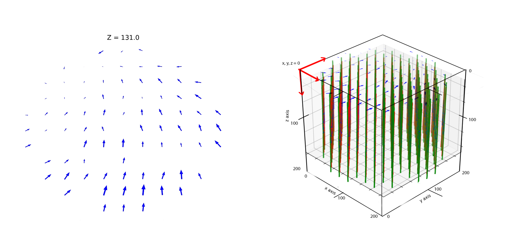

.. MRIphantom documentation master file, created by
   sphinx-quickstart on Mon Sep 12 11:35:53 2022.
   You can adapt this file completely to your liking, but it should at least
   contain the root `toctree` directive.

Welcome to MRIphantom's documentation!
======================================

MRIphantom is an open source software for automatic assessment of stereotactic MRI spatial accuracy

.. note:::
   MRIphantom's development is still in progress. Please contact me if you have any troubles using this software.

.. toctree::
   :maxdepth: 2
   :caption: User Guide:
   :glob:

   userguide/*

